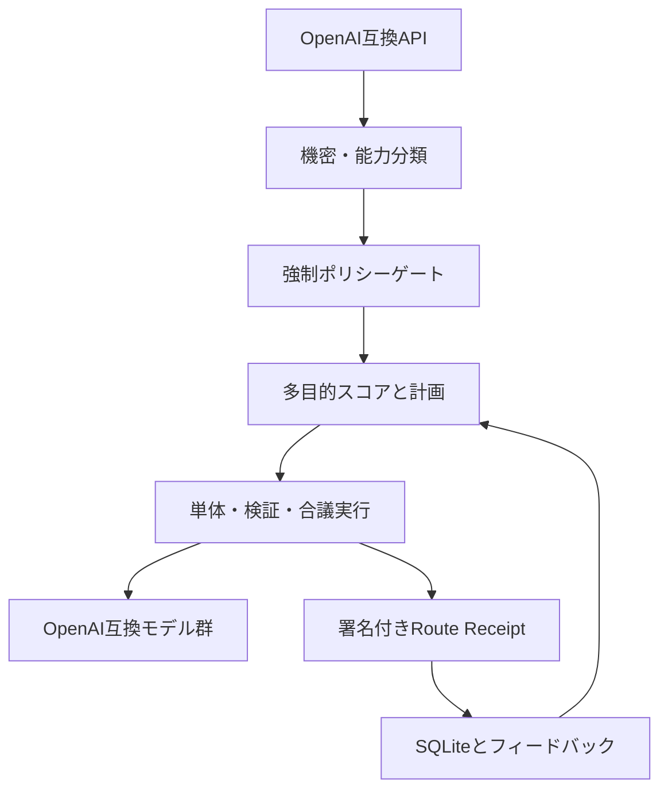

# アーキテクチャ

Rooomtech LLM Routerは、ルーティング判断とモデル実行を分離します。ポリシー違反のモデルは採点対象に入る前に除外されるため、品質スコアが高くても機密・地域制約を迂回できません。

## 1. 強制ポリシーゲート

次の順で適格性を判定します。

1. モデルが有効か
2. テナントがプロバイダーとデプロイ形態を許可しているか
3. リクエストのデータ区分がモデルの上限以下か
4. 指定リージョンで利用できるか
5. `tools`、`vision`、`json`など必要能力を持つか
6. 入出力がコンテキスト上限内か
7.単体呼び出しが費用・遅延上限内か

除外理由は `RoutePlan.rejected` に残り、`POST /v1/route/plan` と `GET /v1/routes/{id}` で確認できます。

## 2. 多目的スコア

適格モデルだけに、次のスコアを計算します。

\[
S = w_q Q + w_r R + w_c C + w_l L + w_p P + E
\]

- \(Q\): 設定したタスク別品質事前値と利用者フィードバックの事後平均
- \(R\): 成功・失敗履歴を平滑化した信頼性
- \(C\): 費用上限に対する余裕
- \(L\): 遅延上限に対する余裕
- \(P\): ローカル実行を優先するプライバシー係数
- \(E\): 未評価モデルを完全に無視しない探索ボーナス

重みはテナント別に設定できます。費用や機密性はスコアで「推奨」するだけでなく、前段の強制ゲートでも拒否します。

## 3. トポロジー

| トポロジー | 実行 |
|---|---|
| `direct` | 最高得点モデルを1回呼び出す |
| `cascade` | 最高得点から順に呼び、障害時だけ次へ切り替える |
| `draft_verify` | 第1モデルの回答を異なるモデルが独立検証し、修正版を返す |
| `parallel_consensus` | 異なるプロバイダーへ並列依頼し、候補を最終モデルが検証・統合する |

ツール呼び出しを含むターンでは、ツール状態の競合を避けるため自動モードを `cascade` にします。クライアントがツール結果を返した次のターンで再度ルーティングします。

## 4. Route Receipt

Receiptには次を保存します。

- リクエスト本文のSHA-256
- テナント、データ区分、タスク分類
- 計画と実行トポロジー
- 選定モデルと役割
- 各呼び出しの成功・失敗、所要時間、トークン、費用
- 全体の状態、費用、所要時間

プロンプト本文、回答本文、APIキーは保存しません。Receipt全体のSHA-256に加え、秘密鍵が設定されている場合はHMAC-SHA256署名を返します。

## 5. 障害処理

モデルごとに連続失敗回数を保持し、閾値に達するとCircuit Breakerを開きます。復旧時間後に半開状態相当で再試行します。`cascade` は開いているモデルを飛ばし、次の適格モデルへ進みます。

## 6. 永続化

SQLiteに以下だけを保存します。

- Route Receipt
- ルート計画
- モデル別・タスク別の成功、失敗、遅延EWMA
- 0から1の利用者報酬
- 任意で有効化した完全一致応答キャッシュ

閉域単体構成を優先した初期実装です。`RouterStore`の境界を維持したまま、PostgreSQLやRedisへ差し替えられます。

